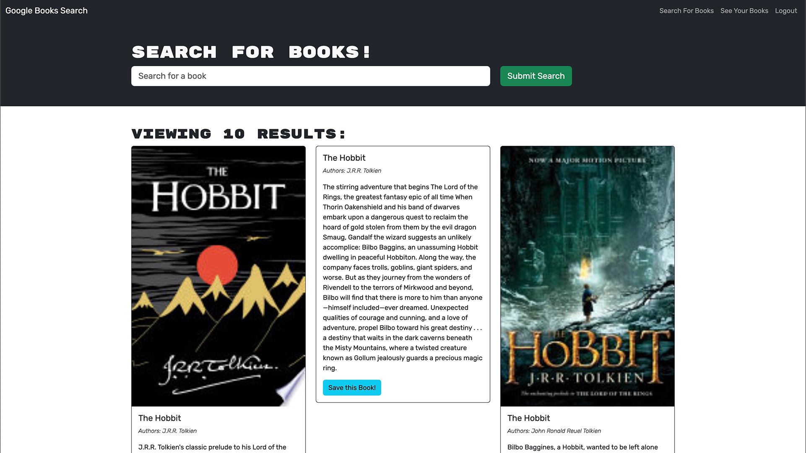
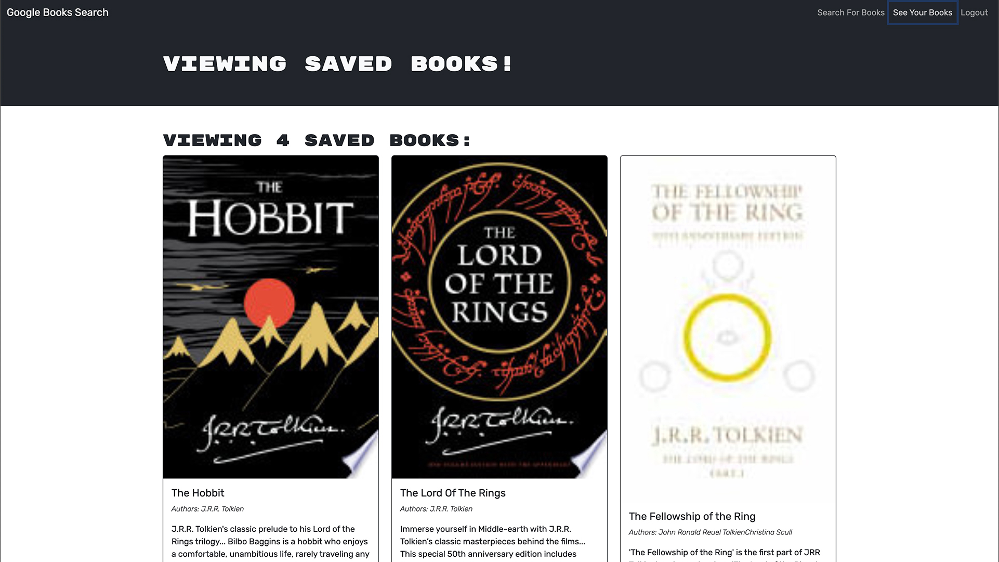

# AA's Full-stack (MERN) Book Search Engine

## Description

This project is a full-stack web app utilizing the Google Books API to search and save books to user accounts.

- This project was created to make an easy way to find books and store the books to a handy book list containing useful information. User books are saved to their accounts so they can always have it handy if they need a quick book recommendation.

- This project was a RESTFUL API to GraphQL API conversion. It was great practice for understanding the logic flow of an application using Apollo + GraphQL, and I feel much more confident in my ability to use these technologies going forward.  

## Usage

### [Experience the deployed application via this link.]()

#### Book search screenshot:

#### Saved Books screenshot:

## License

[MIT](./LICENSE)

---